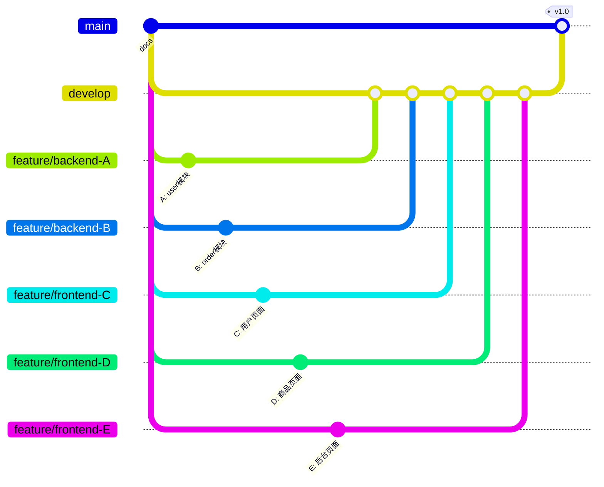

# 任务分工与开发计划

**项目名称：** 校园二手物品交易平台

**编写日期：** 2026年7月4日

**小组成员数：** 5人

---

## 1. 总体角色分配

| 角色 | 人数 | 人员 | 职责概述 |
|:---|:---:|:---|:---|
| **后端开发** | 2人 | A、B | SpringBoot RESTful API 开发 |
| **前端开发** | 2人 | C、D | Vue3 页面与组件开发 |
| **全栈/测试** | 1人 | E | 管理后台前端 + 接口联调 + 测试 + 进度协调 |

---

## 2. 开发阶段计划

```
第1周 ── 环境搭建 + 基础框架
第2周 ── 核心功能开发（用户 + 商品）
第3周 ── 核心功能开发（订单 + 消息）
第4周 ── 管理后台 + 联调测试
```

---

## 3. 详细任务分工

### 3.1 后端开发 — 人员 A

**负责模块：** 用户模块 + 商品模块

| 序号 | 任务 | 接口 | 优先级 | 预计工时 |
|:---:|:---|:---|:---:|:---:|
| 1 | **项目骨架搭建** | — | P0 | 1天 |
| | SpringBoot 项目初始化，Maven 依赖配置 | | | |
| | 统一返回结果封装（Result / PageResult） | | | |
| | 全局异常处理（GlobalExceptionHandler） | | | |
| | CORS 跨域配置 | | | |
| 2 | **安全框架集成** | — | P0 | 1天 |
| | SpringSecurity + JWT 配置 | | | |
| | JWT 认证过滤器编写 | | | |
| | RBAC 权限注解封装 | | | |
| 3 | **用户注册/登录** | 3个接口 | P0 | 1.5天 |
| | 用户注册 `POST /api/v1/user/register` | | | |
| | 用户登录 `POST /api/v1/user/login` | | | |
| | 发送验证码 `POST /api/v1/user/code` | | | |
| 4 | **用户个人信息** | 4个接口 | P1 | 1天 |
| | 获取/更新个人信息 `GET/PUT /api/v1/user/info` | | | |
| | 上传头像 `POST /api/v1/user/avatar` | | | |
| | 刷新/退出 Token 接口 | | | |
| 5 | **地址管理** | 5个接口 | P1 | 1天 |
| | 地址 CRUD + 设为默认 | | | |
| 6 | **商品发布与图片上传** | 3个接口 | P0 | 1.5天 |
| | 发布商品 `POST /api/v1/product` | | | |
| | 上传商品图片 `POST /api/v1/product/upload/image` | | | |
| | 通用图片上传 `POST /api/v1/upload/image` | | | |
| 7 | **商品管理与搜索** | 4个接口 | P0 | 1.5天 |
| | 商品列表（分页+搜索+排序）`GET /api/v1/product/list` | | | |
| | 商品详情 `GET /api/v1/product/{id}` | | | |
| | 编辑/删除商品 | | | |
| | 修改商品状态 | | | |
| 8 | **分类与收藏** | 3个接口 | P1 | 1天 |
| | 分类列表 `GET /api/v1/category/list` | | | |
| | 收藏/取消收藏 | | | |
| | 收藏列表 | | | |
| 9 | **首页推荐** | 1个接口 | P2 | 0.5天 |
| | 首页推荐 `GET /api/v1/index/recommend` | | | |

> **人员 A 小计：** 约 **9天** 工作量，共 **23个接口**

---

### 3.2 后端开发 — 人员 B

**负责模块：** 订单模块 + 消息模块 + 后台管理模块

| 序号 | 任务 | 接口 | 优先级 | 预计工时 |
|:---:|:---|:---|:---:|:---:|
| 1 | **购物车** | 4个接口 | P1 | 1天 |
| | 加入购物车 `POST /api/v1/cart` | | | |
| | 购物车列表 `GET /api/v1/cart/list` | | | |
| | 更新/删除购物车项 | | | |
| 2 | **订单核心流程** | 5个接口 | P0 | 2天 |
| | 创建订单 `POST /api/v1/order` | | | |
| | 订单列表 `GET /api/v1/order/list` | | | |
| | 订单详情 `GET /api/v1/order/{id}` | | | |
| | 取消订单 `PUT /api/v1/order/{id}/cancel` | | | |
| | 订单日志 `GET /api/v1/order/{id}/log` | | | |
| 3 | **订单状态流转** | 3个接口 | P0 | 1.5天 |
| | 支付订单 `PUT /api/v1/order/{id}/pay`（模拟） | | | |
| | 确认发货 `PUT /api/v1/order/{id}/ship` | | | |
| | 确认收货 `PUT /api/v1/order/{id}/receive` | | | |
| 4 | **交易评价** | 1个接口 | P1 | 0.5天 |
| | 评价订单 `POST /api/v1/order/{id}/review` | | | |
| 5 | **站内消息** | 4个接口 | P1 | 1.5天 |
| | 会话列表 `GET /api/v1/message/conversations` | | | |
| | 聊天记录 `GET /api/v1/message/conversation/{userId}` | | | |
| | 发送消息 `POST /api/v1/message/send` | | | |
| | 标记已读/未读消息数 | | | |
| 6 | **系统通知** | 2个接口 | P2 | 0.5天 |
| | 通知列表 `GET /api/v1/notification/list` | | | |
| | 标记通知已读 `PUT /api/v1/notification/read/{id}` | | | |
| 7 | **后台-用户管理** | 2个接口 | P1 | 0.5天 |
| | 用户列表 `GET /api/v1/admin/users` | | | |
| | 禁用/启用/改角色 | | | |
| 8 | **后台-商品审核** | 2个接口 | P1 | 0.5天 |
| | 待审核列表 `GET /api/v1/admin/product/review` | | | |
| | 审核/违规下架 | | | |
| 9 | **后台-订单管理** | 1个接口 | P1 | 0.5天 |
| | 订单管理列表 `GET /api/v1/admin/orders` | | | |
| 10 | **后台-数据统计** | 1个接口 | P2 | 1天 |
| | 总览统计 `GET /api/v1/admin/statistics` | | | |
| | 详细统计（图表数据）`GET /api/v1/admin/statistics/detail` | | | |
| 11 | **后台-公告管理** | 3个接口 | P2 | 0.5天 |
| | 公告 CRUD | | | |
| 12 | **公共接口** | 1个接口 | P2 | 0.5天 |
| | 公告列表（公开）`GET /api/v1/announcement/list` | | | |

> **人员 B 小计：** 约 **10天** 工作量，共 **28个接口**

---

### 3.3 前端开发 — 人员 C

**负责页面：** 首页 + 用户端页面（登录/注册/个人中心）

| 序号 | 任务 | 对应页面 | 优先级 | 预计工时 |
|:---:|:---|:---|:---:|:---:|
| 1 | **项目脚手架搭建** | — | P0 | 1天 |
| | Vue3 + Vite + TypeScript 项目初始化 | | | |
| | Element Plus 组件库集成 | | | |
| | Axios 封装（请求拦截器、统一错误处理） | | | |
| | Vue Router 路由配置 | | | |
| | Pinia Store 初始化 | | | |
| 2 | **布局组件** | — | P0 | 1天 |
| | MainLayout（顶部导航+侧栏+内容区） | | | |
| | AdminLayout（后台管理布局） | | | |
| | 公共组件：Header、Footer、Sidebar | | | |
| 3 | **登录/注册页** | `/login`, `/register` | P0 | 1.5天 |
| | 登录表单（账号密码/验证码登录） | | | |
| | 注册表单（邮箱/手机号+验证码） | | | |
| | 密码找回页面 | | | |
| | 表单校验逻辑 | | | |
| 4 | **首页** | `/` | P0 | 1.5天 |
| | 顶部搜索栏 + 分类导航 | | | |
| | 商品推荐卡片网格展示 | | | |
| | 公告栏展示 | | | |
| | 轮播图（可选） | | | |
| 5 | **个人中心** | `/user/profile` | P1 | 1.5天 |
| | 用户信息展示与编辑 | | | |
| | 头像上传（裁剪预览） | | | |
| | 收货地址管理（列表/新增/编辑/删除） | | | |
| 6 | **我的收藏** | `/user/favorites` | P1 | 0.5天 |
| | 收藏商品列表展示 | | | |
| | 取消收藏操作 | | | |
| 7 | **消息通知** | `/user/notifications` | P2 | 1天 |
| | 通知列表页面 | | | |
| | 消息已读/未读状态切换 | | | |

> **人员 C 小计：** 约 **8天** 工作量，共 **7个页面/模块**

---

### 3.4 前端开发 — 人员 D

**负责页面：** 商品相关页面 + 订单相关页面 + 站内信

| 序号 | 任务 | 对应页面 | 优先级 | 预计工时 |
|:---:|:---|:---|:---:|:---:|
| 1 | **商品列表页** | `/product/list` | P0 | 2天 |
| | 分类侧栏筛选 | | | |
| | 关键词搜索框 | | | |
| | 商品卡片网格展示 | | | |
| | 排序切换（价格/时间/热度） | | | |
| | 分页组件 | | | |
| 2 | **商品详情页** | `/product/:id` | P0 | 1.5天 |
| | 图片轮播展示 | | | |
| | 商品信息展示 | | | |
| | 卖家信息卡片 | | | |
| | 收藏按钮（❤️） | | | |
| | 立即购买/加入购物车按钮 | | | |
| 3 | **商品发布页** | `/product/publish` | P0 | 1.5天 |
| | 多图片上传组件（预览+排序+删除） | | | |
| | 富文本编辑器（商品描述） | | | |
| | 分类选择器 | | | |
| | 价格/成色等表单 | | | |
| 4 | **购物车页** | `/cart` | P1 | 1天 |
| | 购物车商品列表 | | | |
| | 数量修改/删除 | | | |
| | 选中/取消选中 | | | |
| | 结算按钮 | | | |
| 5 | **订单列表页** | `/order/list` | P0 | 1天 |
| | 订单状态 Tab 切换 | | | |
| | 订单卡片展示 | | | |
| | 不同状态的操作按钮 | | | |
| 6 | **订单详情页** | `/order/:id` | P0 | 1天 |
| | 订单信息展示 | | | |
| | 物流信息展示 | | | |
| | 订单状态时间线 | | | |
| | 操作按钮（支付/取消/收货/评价） | | | |
| 7 | **站内信页面** | `/message` | P1 | 1.5天 |
| | 左侧会话列表 | | | |
| | 右侧聊天窗口 | | | |
| | 消息发送输入框 | | | |
| | 未读消息标记 | | | |

> **人员 D 小计：** 约 **9.5天** 工作量，共 **7个页面/模块**

---

### 3.5 全栈/测试 — 人员 E

**负责内容：** 管理后台前端开发 + 接口联调 + 系统测试 + 文档更新

| 序号 | 任务 | 对应页面 | 优先级 | 预计工时 |
|:---:|:---|:---|:---:|:---:|
| 1 | **后台-用户管理页** | `/admin/users` | P1 | 1天 |
| | 用户列表表格展示 | | | |
| | 搜索/筛选 | | | |
| | 禁用/启用/改角色操作 | | | |
| 2 | **后台-商品审核页** | `/admin/products` | P1 | 1天 |
| | 待审核商品列表 | | | |
| | 商品详情预览 | | | |
| | 通过/驳回操作（含驳回原因输入） | | | |
| 3 | **后台-订单管理页** | `/admin/orders` | P1 | 0.5天 |
| | 订单查询与列表展示 | | | |
| 4 | **后台-数据统计页** | `/admin/stats` | P2 | 1.5天 |
| | 总览卡片（用户数/商品数/订单数/交易额） | | | |
| | ECharts 图表：趋势图、柱状图、饼图 | | | |
| | 时间维度切换（日/周/月/年） | | | |
| 5 | **后台-公告管理页** | `/admin/announcements` | P2 | 0.5天 |
| | 公告列表 + 发布/编辑/删除 | | | |
| 6 | **接口联调与测试** | 全局 | P0 | 3天 |
| | 协助 A、B 进行前后端接口联调 | | | |
| | Postman 接口测试集合维护 | | | |
| | Bug 记录与跟踪 | | | |
| 7 | **文档维护** | 全局 | P1 | 1天 |
| | 更新接口文档 | | | |
| | 编写用户使用说明书 | | | |
| | 汇总各阶段文档 | | | |

> **人员 E 小计：** 约 **8.5天** 工作量，共 **5个后台页面 + 联调测试**

---

## 4. 跨模块协作流程

```mermaid
sequenceDiagram
    participant C as 前端C(用户页)
    participant D as 前端D(商品/订单)
    participant E as 前端E(管理后台)
    participant A as 后端A(用户/商品)
    participant B as 后端B(订单/消息/后台)
    
    Note over C,A: 第一周：环境搭建
    C->>C: 搭建 Vue3 项目
    A->>A: 搭建 SpringBoot 项目
    
    Note over C,A: 第二周：用户模块联调
    C->>A: 登录/注册/个人中心 联调
    
    Note over D,A: 第二周：商品模块联调
    D->>A: 商品发布/列表/详情 联调
    
    Note over D,B: 第三周：订单模块联调
    D->>B: 购物车/订单 联调
    
    Note over E,B: 第四周：后台联调
    E->>B: 管理后台全功能联调
    
    Note over C,D,E: 全程：样式统一 + Bug修复
```

---

## 5. 前后端对接规范

### 5.1 接口对接流程

```
后端定义接口 → 生成 Swagger 文档 → 前端按文档对接 → 联调测试
```

- 后端（A、B）使用 **Knife4j**（Swagger增强）自动生成 API 文档
- 前端（C、D、E）通过 Swagger 页面查看接口定义并调用

### 5.2 接口状态约定

| 后端状态 | 含义 | 前端处理 |
|:---|:---|:---|
| `200` | 成功 | 正常展示数据 |
| `400` | 参数错误 | 提示用户检查输入 |
| `401` | 未登录/Token过期 | 跳转登录页 |
| `403` | 无权限 | 提示无权限 |
| `404` | 资源不存在 | 跳转404页面 |
| `500` | 服务器错误 | 提示"系统繁忙" |

### 5.3 代码仓库约定

| 项目 | 仓库/目录 | 说明 |
|:---|:---|:---|
| **后端** | `zhuanzhuan-backend/` | SpringBoot Maven 项目 |
| **前端** | `zhuanzhuan-frontend/` | Vue3 + Vite 项目 |

---

## 6. 每日站会与进度追踪

### 6.1 每日站会

每人简要汇报（5分钟）：

1. 昨天完成了什么？
2. 今天计划做什么？
3. 遇到什么阻塞？

### 6.2 阶段里程碑

| 阶段 | 截止时间 | 交付物 | 验收标准 |
|:---|:---:|:---|:---|
| **M1 环境搭建** | 第1周末 | 可运行的前后端空项目 | `npm run dev` + `mvn spring-boot:run` 均正常启动 |
| **M2 用户模块** | 第2周中 | 注册/登录/个人信息功能联调通过 | 前后端成功对接所有用户接口 |
| **M3 商品模块** | 第2周末 | 商品发布/浏览/搜索联调通过 | 可正常发布和浏览商品 |
| **M4 订单模块** | 第3周末 | 下单/支付/物流联调通过 | 完整走通交易流程 |
| **M5 消息模块** | 第4周初 | 站内信/通知联调通过 | 可发送和接收消息 |
| **M6 管理后台** | 第4周中 | 后台全功能可用 | 管理员可审核/统计/管理 |
| **M7 系统联调** | 第4周末 | 全流程跑通 | 一个完整交易流程走通 |

---

## 7. Git 分支策略



| 分支 | 用途 |
|:---|:---|
| `main` | 稳定版本，只合并不直接开发 |
| `develop` | 开发主分支，每日合并 |
| `feature/backend-A` | A 的开发分支 |
| `feature/backend-B` | B 的开发分支 |
| `feature/frontend-C` | C 的开发分支 |
| `feature/frontend-D` | D 的开发分支 |
| `feature/frontend-E` | E 的开发分支 |

---

## 附录：工作量汇总

| 人员 | 角色 | 接口/页面数 | 预计工时 | 负责模块 |
|:---:|:---|:---:|:---:|:---|
| **A** | 后端开发1 | 23个接口 | ~9天 | 用户模块 + 商品模块 |
| **B** | 后端开发2 | 28个接口 | ~10天 | 订单 + 消息 + 后台管理 |
| **C** | 前端开发1 | 7个页面 | ~8天 | 首页 + 用户端页面 |
| **D** | 前端开发2 | 7个页面 | ~9.5天 | 商品 + 订单 + 消息页面 |
| **E** | 全栈/测试 | 5个页面 | ~8.5天 | 管理后台 + 联调 + 测试 |
