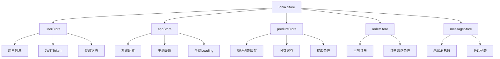
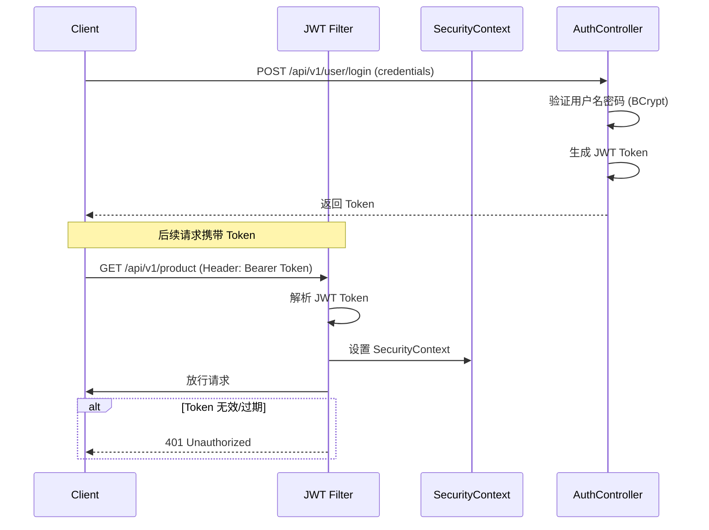
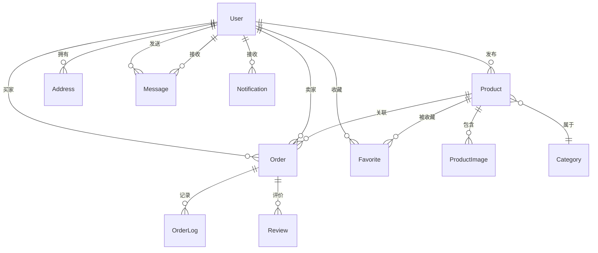

# 系统架构设计说明书

**项目名称：** 校园二手物品交易平台

**版本号：** V1.0

**编写日期：** 2026年7月4日

---

## 1. 引言

### 1.1 编写目的

本文档旨在对校园二手物品交易平台进行全面的系统架构设计，明确系统的技术选型、架构风格、模块划分、数据库设计、接口规范及部署方案，为后续的详细设计与编码实现提供技术指导。

### 1.2 适用范围

本文档适用于本项目的系统架构师、后端开发工程师、前端开发工程师、测试工程师及项目管理人员。

### 1.3 参考文档

| 序号 | 文档名称 |
|:---|:---|
| 1 | 《软件需求规格说明书》—— docs/需求分析/软件需求规格说明书.md |
| 2 | 《项目指导书》—— docs/项目指导书.md |

---

## 2. 系统总体架构

### 2.1 架构风格

本系统采用**前后端分离架构**，前端为单页应用（SPA），后端提供RESTful API服务。前后端通过HTTP/HTTPS协议进行数据交互，使用JWT实现无状态认证。

### 2.2 系统架构图

```
┌─────────────────────────────────────────────────────────────────────┐
│                           客户端层 (Client)                          │
│  ┌───────────────────────────────────────────────────────────────┐  │
│  │              Vue3 SPA (Element Plus UI)                       │  │
│  │    Axios HTTP  ·  Vue Router  ·  Pinia 状态管理               │  │
│  └──────────┬────────────────────────────────────────────────────┘  │
└─────────────┼───────────────────────────────────────────────────────┘
              │ HTTPS / RESTful API (JWT Token)
              ▼
┌─────────────────────────────────────────────────────────────────────┐
│                       网关层 (Gateway)                               │
│  ┌───────────────────────────────────────────────────────────────┐  │
│  │   SpringBoot 统一入口  ·  CORS 跨域配置                        │  │
│  │   JWT 过滤器  ·  统一认证鉴权  ·  请求日志                      │  │
│  └──────────┬────────────────────────────────────────────────────┘  │
└─────────────┼───────────────────────────────────────────────────────┘
              ▼
┌─────────────────────────────────────────────────────────────────────┐
│                       业务层 (Service)                               │
│  ┌────────────┬────────────┬────────────┬────────────┐             │
│  │  用户模块   │  商品模块   │  订单模块   │  消息模块   │             │
│  │  认证服务   │  商品服务   │  订单服务   │  消息服务   │             │
│  │  用户服务   │  分类服务   │  支付服务   │  通知服务   │             │
│  │  地址服务   │  收藏服务   │  物流服务   │             │             │
│  └─────┬──────┴──────┬─────┴──────┬─────┴──────┬──────┘             │
│        │             │            │            │                     │
│  ┌─────┴──────────────┴────────────┴────────────┴──────────────┐   │
│  │                    公共服务层 (Common)                         │   │
│  │    文件服务  ·  缓存服务  ·  验证码服务  ·  搜索引擎            │   │
│  └────────────────────────────────────────────────────────────┘   │
└─────────────────────────────────────────────────────────────────────┘
              │
              ▼
┌─────────────────────────────────────────────────────────────────────┐
│                     数据层 (Data)                                    │
│  ┌─────────────────────┐  ┌─────────────────────┐                  │
│  │      MySQL 8.0      │  │      Redis 6.0+     │                  │
│  │  用户表 · 商品表    │  │  会话缓存 · 验证码   │                  │
│  │  订单表 · 消息表    │  │  热点商品 · 分类缓存  │                  │
│  └─────────────────────┘  └─────────────────────┘                  │
└─────────────────────────────────────────────────────────────────────┘
```

### 2.3 技术选型

| 层级 | 技术 | 版本 | 说明 |
|:---|:---|:---:|:---|
| **前端框架** | Vue 3 | 3.4+ | 组合式API + TypeScript |
| **UI组件库** | Element Plus | 2.5+ | 企业级UI组件 |
| **状态管理** | Pinia | 2.1+ | Vue3官方状态管理 |
| **路由管理** | Vue Router | 4.2+ | SPA路由控制 |
| **HTTP客户端** | Axios | 1.6+ | 请求拦截器、统一错误处理 |
| **后端框架** | Spring Boot | 3.2+ | 微服务快速开发框架 |
| **安全框架** | Spring Security | 6.x+ | 认证与授权 |
| **ORM框架** | MyBatis-Plus | 3.5+ | 数据库操作增强 |
| **数据库** | MySQL | 8.0+ | 关系型数据库 |
| **缓存** | Redis | 6.0+ | 高性能缓存 |
| **令牌** | JWT | 0.12+ | 无状态认证 |
| **接口文档** | Knife4j | 4.3+ | Swagger增强 |
| **项目构建** | Maven | 3.9+ | 后端构建工具 |
| **构建工具** | Vite | 5.0+ | 前端构建工具 |

---

## 3. 前端架构设计

### 3.1 项目结构

```
zhuanzhuan-frontend/
├── public/                       # 静态资源
│   └── favicon.ico
├── src/
│   ├── api/                      # API接口层
│   │   ├── request.ts            # Axios 实例与拦截器
│   │   ├── user.ts               # 用户模块接口
│   │   ├── product.ts            # 商品模块接口
│   │   ├── order.ts              # 订单模块接口
│   │   └── message.ts            # 消息模块接口
│   ├── assets/                   # 静态资源
│   │   ├── images/
│   │   └── styles/
│   ├── components/               # 公共组件
│   │   ├── common/               # 通用组件
│   │   ├── product/              # 商品相关组件
│   │   └── layout/               # 布局组件
│   ├── composables/              # 组合式函数
│   ├── layouts/                  # 布局模板
│   │   ├── MainLayout.vue        # 主布局
│   │   └── AdminLayout.vue       # 管理后台布局
│   ├── router/                   # 路由配置
│   │   └── index.ts
│   ├── stores/                   # Pinia 状态管理
│   │   ├── user.ts               # 用户状态
│   │   └── app.ts                # 应用状态
│   ├── utils/                    # 工具函数
│   │   ├── auth.ts               # 认证工具
│   │   └── format.ts             # 格式化工具
│   ├── views/                    # 页面组件
│   │   ├── home/                 # 首页
│   │   ├── product/              # 商品相关页面
│   │   ├── order/                # 订单相关页面
│   │   ├── user/                 # 个人中心页面
│   │   ├── message/              # 消息页面
│   │   └── admin/                # 后台管理页面
│   ├── App.vue
│   └── main.ts
├── index.html
├── vite.config.ts
├── tsconfig.json
└── package.json
```

### 3.2 路由设计

| 路由路径 | 页面组件 | 权限 | 说明 |
|:---|:---|:---:|:---|
| `/` | HomePage.vue | 公开 | 首页 |
| `/login` | LoginPage.vue | 公开 | 登录页 |
| `/register` | RegisterPage.vue | 公开 | 注册页 |
| `/product/list` | ProductList.vue | 公开 | 商品列表 |
| `/product/:id` | ProductDetail.vue | 公开 | 商品详情 |
| `/product/publish` | ProductPublish.vue | 卖家 | 发布商品 |
| `/cart` | CartPage.vue | 用户 | 购物车 |
| `/order/list` | OrderList.vue | 用户 | 订单列表 |
| `/order/:id` | OrderDetail.vue | 用户 | 订单详情 |
| `/user/profile` | UserProfile.vue | 用户 | 个人中心 |
| `/user/address` | AddressManage.vue | 用户 | 地址管理 |
| `/user/favorites` | UserFavorites.vue | 用户 | 我的收藏 |
| `/message` | MessagePage.vue | 用户 | 站内信 |
| `/admin/users` | AdminUsers.vue | 管理员 | 用户管理 |
| `/admin/products` | AdminProducts.vue | 管理员 | 商品审核 |
| `/admin/orders` | AdminOrders.vue | 管理员 | 订单管理 |
| `/admin/stats` | AdminStats.vue | 管理员 | 数据统计 |
| `/admin/announcements` | AdminAnnouncements.vue | 管理员 | 公告管理 |

### 3.3 状态管理设计 (Pinia)



### 3.4 前端数据流

```
用户操作 → Vue Component → Pinia Action → API Call (Axios)
                                                    │
                                                    ▼
                                            SpringBoot Backend
                                                    │
                                                    ▼
用户界面 ← Vue Component ← Pinia State ← API Response
```

---

## 4. 后端架构设计

### 4.1 项目结构

```
zhuanzhuan-backend/
├── src/main/java/com/zhuanzhuan/
│   ├── ZhuanZhuanApplication.java       # 启动类
│   ├── common/
│   │   ├── config/                      # 配置类
│   │   │   ├── CorsConfig.java          # 跨域配置
│   │   │   ├── RedisConfig.java         # Redis配置
│   │   │   ├── SecurityConfig.java      # 安全配置
│   │   │   └── SwaggerConfig.java       # 接口文档配置
│   │   ├── constant/                    # 常量定义
│   │   ├── exception/                   # 异常处理
│   │   │   ├── GlobalExceptionHandler.java
│   │   │   └── BusinessException.java
│   │   ├── result/                      # 统一返回结果
│   │   │   ├── Result.java
│   │   │   └── PageResult.java
│   │   └── util/                        # 工具类
│   │       ├── JwtUtil.java
│   │       └── RedisUtil.java
│   ├── modules/
│   │   ├── user/                        # 用户模块
│   │   │   ├── controller/UserController.java
│   │   │   ├── service/UserService.java
│   │   │   ├── service/impl/UserServiceImpl.java
│   │   │   ├── mapper/UserMapper.java
│   │   │   ├── entity/User.java
│   │   │   ├── dto/UserLoginDTO.java
│   │   │   ├── dto/UserRegisterDTO.java
│   │   │   └── vo/UserVO.java
│   │   ├── product/                     # 商品模块
│   │   │   ├── controller/ProductController.java
│   │   │   ├── service/ProductService.java
│   │   │   ├── service/impl/ProductServiceImpl.java
│   │   │   ├── mapper/ProductMapper.java
│   │   │   ├── entity/Product.java
│   │   │   └── entity/ProductImage.java
│   │   ├── order/                       # 订单模块
│   │   │   ├── controller/OrderController.java
│   │   │   ├── service/OrderService.java
│   │   │   ├── service/impl/OrderServiceImpl.java
│   │   │   ├── mapper/OrderMapper.java
│   │   │   └── entity/Order.java
│   │   ├── message/                     # 消息模块
│   │   │   ├── controller/MessageController.java
│   │   │   ├── service/MessageService.java
│   │   │   └── entity/Message.java
│   │   └── admin/                       # 后台管理模块
│   │       ├── controller/AdminController.java
│   │       └── service/AdminService.java
│   └── security/                        # 安全模块
│       ├── JwtAuthenticationFilter.java
│       └── UserDetailsServiceImpl.java
├── src/main/resources/
│   ├── application.yml
│   ├── application-dev.yml
│   └── application-prod.yml
├── pom.xml
└── README.md
```

### 4.2 分层架构

```
┌─────────────────────────────────────────────────────┐
│              Controller 层 (接口控制器)                │
│  接收请求 · 参数校验 · 调用Service · 返回结果          │
├─────────────────────────────────────────────────────┤
│              Service 层 (业务逻辑层)                   │
│  核心业务逻辑 · 事务管理 · 业务规则校验                │
├─────────────────────────────────────────────────────┤
│              Mapper 层 (数据访问层)                    │
│  MyBatis-Plus · 数据库CRUD · 复杂查询                 │
├─────────────────────────────────────────────────────┤
│              Entity 层 (实体模型层)                    │
│  POJO · 数据库表映射 · DTO · VO                      │
└─────────────────────────────────────────────────────┘
```

### 4.3 认证与授权流程



### 4.4 统一响应格式

```json
// 成功响应
{
  "code": 200,
  "message": "success",
  "data": {}
}

// 失败响应
{
  "code": 400,
  "message": "参数错误",
  "data": null
}

// 分页响应
{
  "code": 200,
  "message": "success",
  "data": {
    "records": [],
    "total": 100,
    "page": 1,
    "size": 10
  }
}
```

---

## 5. 数据库设计

### 5.1 实体关系图 (E-R图)



### 5.2 数据库表结构

#### 5.2.1 用户表 (user)

| 字段名 | 类型 | 长度 | 主键 | 非空 | 说明 |
|:---|:---|:---:|:---:|:---:|:---|
| id | BIGINT | 20 | ✔ | ✔ | 用户ID |
| username | VARCHAR | 50 | | ✔ | 用户名 |
| password_hash | VARCHAR | 255 | | ✔ | 密码(BCrypt) |
| email | VARCHAR | 100 | | | 邮箱 |
| phone | VARCHAR | 20 | | | 手机号 |
| avatar | VARCHAR | 255 | | | 头像URL |
| nickname | VARCHAR | 50 | | | 昵称 |
| bio | VARCHAR | 200 | | | 个人简介 |
| role | ENUM | | | ✔ | 角色(user/admin) |
| credit_score | INT | 11 | | | 信誉分(默认100) |
| status | TINYINT | 4 | | ✔ | 状态(0禁用/1启用) |
| created_at | DATETIME | | | ✔ | 创建时间 |
| updated_at | DATETIME | | | ✔ | 更新时间 |
| deleted_at | DATETIME | | | | 删除时间(软删除) |

> **索引：** 唯一索引 `uk_email` (email)，唯一索引 `uk_phone` (phone)，索引 `idx_username` (username)

#### 5.2.2 商品表 (product)

| 字段名 | 类型 | 长度 | 主键 | 非空 | 说明 |
|:---|:---|:---:|:---:|:---:|:---|
| id | BIGINT | 20 | ✔ | ✔ | 商品ID |
| user_id | BIGINT | 20 | | ✔ | 卖家ID |
| category_id | BIGINT | 20 | | ✔ | 分类ID |
| title | VARCHAR | 100 | | ✔ | 商品标题 |
| description | TEXT | | | | 商品描述(富文本) |
| price | DECIMAL | 10,2 | | ✔ | 价格(元) |
| condition | ENUM | | | ✔ | 成色(全新/几乎全新/轻微使用/明显使用/老旧) |
| cover_image | VARCHAR | 255 | | | 封面图URL |
| view_count | INT | 11 | | | 浏览量(默认0) |
| favorite_count | INT | 11 | | | 收藏数(默认0) |
| status | ENUM | | | ✔ | 状态(待审核/在售/已下架/已售出/审核驳回) |
| created_at | DATETIME | | | ✔ | 发布时间 |
| updated_at | DATETIME | | | ✔ | 更新时间 |
| deleted_at | DATETIME | | | | 删除时间(软删除) |

> **索引：** 索引 `idx_user_id` (user_id)，索引 `idx_category_id` (category_id)，索引 `idx_status` (status)，全文索引 `ft_title_desc` (title, description)

#### 5.2.3 商品图片表 (product_image)

| 字段名 | 类型 | 长度 | 主键 | 非空 | 说明 |
|:---|:---|:---:|:---:|:---:|:---|
| id | BIGINT | 20 | ✔ | ✔ | 图片ID |
| product_id | BIGINT | 20 | | ✔ | 商品ID |
| url | VARCHAR | 255 | | ✔ | 图片URL |
| sort_order | INT | 11 | | | 排序(从0开始) |
| created_at | DATETIME | | | ✔ | 上传时间 |

> **索引：** 索引 `idx_product_id` (product_id)

#### 5.2.4 商品分类表 (category)

| 字段名 | 类型 | 长度 | 主键 | 非空 | 说明 |
|:---|:---|:---:|:---:|:---:|:---|
| id | BIGINT | 20 | ✔ | ✔ | 分类ID |
| name | VARCHAR | 50 | | ✔ | 分类名称 |
| parent_id | BIGINT | 20 | | | 父分类ID(0为顶级) |
| level | TINYINT | 4 | | ✔ | 层级(1/2/3) |
| icon | VARCHAR | 255 | | | 分类图标 |
| sort_order | INT | 11 | | | 排序 |
| status | TINYINT | 4 | | ✔ | 状态(0隐藏/1显示) |

> **索引：** 索引 `idx_parent_id` (parent_id)

#### 5.2.5 订单表 (order)

| 字段名 | 类型 | 长度 | 主键 | 非空 | 说明 |
|:---|:---|:---:|:---:|:---:|:---|
| id | BIGINT | 20 | ✔ | ✔ | 订单ID |
| order_no | VARCHAR | 32 | | ✔ | 订单号(唯一) |
| buyer_id | BIGINT | 20 | | ✔ | 买家ID |
| seller_id | BIGINT | 20 | | ✔ | 卖家ID |
| product_id | BIGINT | 20 | | ✔ | 商品ID |
| total_price | DECIMAL | 10,2 | | ✔ | 总价(元) |
| shipping_name | VARCHAR | 50 | | | 收件人 |
| shipping_phone | VARCHAR | 20 | | | 收件电话 |
| shipping_address | VARCHAR | 255 | | | 收货地址 |
| logistics_company | VARCHAR | 50 | | | 物流公司 |
| logistics_no | VARCHAR | 50 | | | 物流单号 |
| buyer_remark | VARCHAR | 200 | | | 买家备注 |
| status | ENUM | | | ✔ | 状态(待付款/待发货/待收货/已完成/已取消) |
| paid_at | DATETIME | | | | 支付时间 |
| shipped_at | DATETIME | | | | 发货时间 |
| received_at | DATETIME | | | | 收货时间 |
| created_at | DATETIME | | | ✔ | 创建时间 |
| updated_at | DATETIME | | | ✔ | 更新时间 |

> **索引：** 唯一索引 `uk_order_no` (order_no)，索引 `idx_buyer_id` (buyer_id)，索引 `idx_seller_id` (seller_id)，索引 `idx_status` (status)

#### 5.2.6 订单日志表 (order_log)

| 字段名 | 类型 | 长度 | 主键 | 非空 | 说明 |
|:---|:---|:---:|:---:|:---:|:---|
| id | BIGINT | 20 | ✔ | ✔ | 日志ID |
| order_id | BIGINT | 20 | | ✔ | 订单ID |
| from_status | VARCHAR | 20 | | | 原状态 |
| to_status | VARCHAR | 20 | | ✔ | 新状态 |
| operator | VARCHAR | 50 | | | 操作人 |
| remark | VARCHAR | 200 | | | 备注 |
| created_at | DATETIME | | | ✔ | 创建时间 |

#### 5.2.7 消息表 (message)

| 字段名 | 类型 | 长度 | 主键 | 非空 | 说明 |
|:---|:---|:---:|:---:|:---:|:---|
| id | BIGINT | 20 | ✔ | ✔ | 消息ID |
| from_user_id | BIGINT | 20 | | ✔ | 发送方ID |
| to_user_id | BIGINT | 20 | | ✔ | 接收方ID |
| content | TEXT | | | ✔ | 消息内容 |
| type | ENUM | | | ✔ | 类型(text/image/system) |
| is_read | TINYINT | 4 | | ✔ | 已读(0未读/1已读) |
| created_at | DATETIME | | | ✔ | 发送时间 |

> **索引：** 索引 `idx_from_user_id` (from_user_id)，索引 `idx_to_user_id` (to_user_id)，索引 `idx_created_at` (created_at)

#### 5.2.8 通知表 (notification)

| 字段名 | 类型 | 长度 | 主键 | 非空 | 说明 |
|:---|:---|:---:|:---:|:---:|:---|
| id | BIGINT | 20 | ✔ | ✔ | 通知ID |
| user_id | BIGINT | 20 | | ✔ | 接收用户ID |
| title | VARCHAR | 100 | | ✔ | 通知标题 |
| content | TEXT | | | ✔ | 通知内容 |
| type | ENUM | | | ✔ | 类型(order/review/system) |
| is_read | TINYINT | 4 | | ✔ | 已读(0未读/1已读) |
| created_at | DATETIME | | | ✔ | 创建时间 |

#### 5.2.9 收藏表 (favorite)

| 字段名 | 类型 | 长度 | 主键 | 非空 | 说明 |
|:---|:---|:---:|:---:|:---:|:---|
| id | BIGINT | 20 | ✔ | ✔ | 收藏ID |
| user_id | BIGINT | 20 | | ✔ | 用户ID |
| product_id | BIGINT | 20 | | ✔ | 商品ID |
| created_at | DATETIME | | | ✔ | 收藏时间 |

> **唯一约束：** `uk_user_product` (user_id, product_id)

#### 5.2.10 收货地址表 (address)

| 字段名 | 类型 | 长度 | 主键 | 非空 | 说明 |
|:---|:---|:---:|:---:|:---:|:---|
| id | BIGINT | 20 | ✔ | ✔ | 地址ID |
| user_id | BIGINT | 20 | | ✔ | 用户ID |
| receiver | VARCHAR | 50 | | ✔ | 收件人 |
| phone | VARCHAR | 20 | | ✔ | 联系电话 |
| province | VARCHAR | 20 | | ✔ | 省份 |
| city | VARCHAR | 20 | | ✔ | 城市 |
| district | VARCHAR | 20 | | ✔ | 区县 |
| detail | VARCHAR | 200 | | ✔ | 详细地址 |
| is_default | TINYINT | 4 | | ✔ | 是否默认(0否/1是) |
| created_at | DATETIME | | | ✔ | 创建时间 |

#### 5.2.11 交易评价表 (review)

| 字段名 | 类型 | 长度 | 主键 | 非空 | 说明 |
|:---|:---|:---:|:---:|:---:|:---|
| id | BIGINT | 20 | ✔ | ✔ | 评价ID |
| order_id | BIGINT | 20 | | ✔ | 订单ID |
| from_user_id | BIGINT | 20 | | ✔ | 评价方ID |
| to_user_id | BIGINT | 20 | | ✔ | 被评价方ID |
| rating | TINYINT | 4 | | ✔ | 评分(1-5) |
| content | VARCHAR | 500 | | | 评价内容 |
| created_at | DATETIME | | | ✔ | 创建时间 |

#### 5.2.12 公告表 (announcement)

| 字段名 | 类型 | 长度 | 主键 | 非空 | 说明 |
|:---|:---|:---:|:---:|:---:|:---|
| id | BIGINT | 20 | ✔ | ✔ | 公告ID |
| admin_id | BIGINT | 20 | | ✔ | 发布人ID |
| title | VARCHAR | 100 | | ✔ | 公告标题 |
| content | TEXT | | | ✔ | 公告内容 |
| status | TINYINT | 4 | | ✔ | 状态(0草稿/1发布) |
| created_at | DATETIME | | | ✔ | 创建时间 |
| updated_at | DATETIME | | | ✔ | 更新时间 |

---

## 6. 缓存设计

### 6.1 Redis 缓存策略

| 缓存对象 | Key 设计 | 数据类型 | 过期时间 | 说明 |
|:---|:---|:---|:---:|:---|
| 验证码 | `captcha:{email/phone}` | String | 5分钟 | 注册/找回密码验证码 |
| 用户会话 | `session:{userId}` | String | 7天 | JWT Token 刷新信息 |
| 热点商品 | `product:{id}` | String (JSON) | 30分钟 | 商品详情缓存 |
| 商品分类 | `category:tree` | String (JSON) | 24小时 | 分类树结构 |
| 首页推荐 | `index:recommend` | ZSet | 10分钟 | 按热度排序的商品ID |
| 商品浏览量 | `view:product:{id}` | String | 持久化 | 定时同步到数据库 |
| 接口防刷 | `rate:limit:{ip}:{api}` | String | 1分钟 | 接口频率限制 |

### 6.2 缓存更新模式

采用 **Cache-Aside Pattern**（旁路缓存模式）：

```
读取： 读取缓存 → 命中？→ 返回 / 查询数据库 → 写入缓存 → 返回
写入： 更新数据库 → 删除缓存
```

---

## 7. 接口设计

### 7.1 接口规范

- **接口风格：** RESTful API
- **基础路径：** `/api/v1/`
- **数据格式：** JSON (UTF-8)
- **认证方式：** JWT Token (Authorization: Bearer \<token\>)
- **分页参数：** `page` (页码), `size` (每页条数)

### 7.2 接口列表

#### 7.2.1 用户模块

| 方法 | 路径 | 说明 | 权限 |
|:---|:---|:---|:---:|
| POST | `/api/v1/user/register` | 用户注册 | 公开 |
| POST | `/api/v1/user/login` | 用户登录 | 公开 |
| POST | `/api/v1/user/logout` | 退出登录 | 登录 |
| POST | `/api/v1/user/refresh` | 刷新Token | 公开 |
| POST | `/api/v1/user/code` | 发送验证码 | 公开 |
| POST | `/api/v1/user/password/reset` | 重置密码 | 公开 |
| GET | `/api/v1/user/info` | 获取个人信息 | 登录 |
| PUT | `/api/v1/user/info` | 更新个人信息 | 登录 |
| POST | `/api/v1/user/avatar` | 上传头像 | 登录 |
| GET | `/api/v1/user/address` | 获取地址列表 | 登录 |
| POST | `/api/v1/user/address` | 新增地址 | 登录 |
| PUT | `/api/v1/user/address/{id}` | 编辑地址 | 登录 |
| DELETE | `/api/v1/user/address/{id}` | 删除地址 | 登录 |
| PUT | `/api/v1/user/address/{id}/default` | 设为默认地址 | 登录 |

#### 7.2.2 商品模块

| 方法 | 路径 | 说明 | 权限 |
|:---|:---|:---|:---:|
| GET | `/api/v1/product/list` | 商品列表(分页) | 公开 |
| GET | `/api/v1/product/{id}` | 商品详情 | 公开 |
| POST | `/api/v1/product` | 发布商品 | 卖家 |
| PUT | `/api/v1/product/{id}` | 编辑商品 | 卖家 |
| DELETE | `/api/v1/product/{id}` | 删除商品 | 卖家 |
| PUT | `/api/v1/product/{id}/status` | 修改商品状态 | 卖家 |
| POST | `/api/v1/product/favorite` | 收藏/取消收藏 | 登录 |
| GET | `/api/v1/product/favorite/list` | 收藏列表 | 登录 |
| GET | `/api/v1/category/list` | 分类列表 | 公开 |
| GET | `/api/v1/product/upload/image` | 上传商品图片 | 卖家 |

#### 7.2.3 订单模块

| 方法 | 路径 | 说明 | 权限 |
|:---|:---|:---|:---:|
| POST | `/api/v1/order` | 创建订单 | 登录 |
| GET | `/api/v1/order/list` | 订单列表 | 登录 |
| GET | `/api/v1/order/{id}` | 订单详情 | 登录 |
| PUT | `/api/v1/order/{id}/cancel` | 取消订单 | 登录 |
| PUT | `/api/v1/order/{id}/pay` | 支付订单 | 登录 |
| PUT | `/api/v1/order/{id}/ship` | 确认发货 | 卖家 |
| PUT | `/api/v1/order/{id}/receive` | 确认收货 | 买家 |
| POST | `/api/v1/order/{id}/review` | 评价订单 | 登录 |
| GET | `/api/v1/order/{id}/log` | 订单日志 | 登录 |
| POST | `/api/v1/cart` | 加入购物车 | 登录 |
| GET | `/api/v1/cart/list` | 购物车列表 | 登录 |
| DELETE | `/api/v1/cart/{id}` | 删除购物车项 | 登录 |

#### 7.2.4 消息模块

| 方法 | 路径 | 说明 | 权限 |
|:---|:---|:---|:---:|
| GET | `/api/v1/message/conversations` | 会话列表 | 登录 |
| GET | `/api/v1/message/conversation/{userId}` | 聊天记录 | 登录 |
| POST | `/api/v1/message/send` | 发送消息 | 登录 |
| PUT | `/api/v1/message/read/{conversationId}` | 标记已读 | 登录 |
| GET | `/api/v1/message/unread/count` | 未读消息数 | 登录 |
| GET | `/api/v1/notification/list` | 通知列表 | 登录 |
| PUT | `/api/v1/notification/read/{id}` | 标记通知已读 | 登录 |

#### 7.2.5 后台管理模块

| 方法 | 路径 | 说明 | 权限 |
|:---|:---|:---|:---:|
| GET | `/api/v1/admin/users` | 用户列表 | 管理员 |
| PUT | `/api/v1/admin/user/{id}/status` | 禁用/启用用户 | 管理员 |
| PUT | `/api/v1/admin/user/{id}/role` | 修改用户角色 | 管理员 |
| GET | `/api/v1/admin/product/review` | 待审核商品列表 | 管理员 |
| PUT | `/api/v1/admin/product/review/{id}` | 审核商品 | 管理员 |
| PUT | `/api/v1/admin/product/{id}/offline` | 违规下架 | 管理员 |
| GET | `/api/v1/admin/orders` | 订单管理列表 | 管理员 |
| GET | `/api/v1/admin/statistics` | 数据统计 | 管理员 |
| GET | `/api/v1/admin/statistics/detail` | 详细统计数据 | 管理员 |
| GET | `/api/v1/admin/announcement` | 公告列表 | 管理员 |
| POST | `/api/v1/admin/announcement` | 发布公告 | 管理员 |
| PUT | `/api/v1/admin/announcement/{id}` | 编辑公告 | 管理员 |
| DELETE | `/api/v1/admin/announcement/{id}` | 删除公告 | 管理员 |

---

## 8. 安全架构设计

### 8.1 认证与授权

```
请求 → JWT认证过滤器 → SecurityContextHolder → 权限校验 → Controller
         │                                                    │
         401 Unauthorized ← 无效Token                     403 Forbidden ← 无权限
```

- **用户认证：** 基于 JWT Token，客户端在登录后获取 Token，后续请求携带于 `Authorization` 请求头
- **角色授权：** 基于 SpringSecurity @PreAuthorize 注解，支持角色级权限控制（ROLE_USER / ROLE_ADMIN）
- **Token 刷新：** Access Token 有效期 2 小时，Refresh Token 有效期 7 天

### 8.2 密码安全

- 使用 **BCryptPasswordEncoder** 进行密码加密与校验
- 每个用户的密码使用随机盐值加密
- 禁止明文存储、禁止明文传输（HTTPS）

### 8.3 Web 安全防护

| 防护类型 | 措施 |
|:---|:---|
| **XSS 防护** | 前端对用户输入做转义处理；后端对富文本内容使用 XSS 过滤库 |
| **CSRF 防护** | 使用 SameSite=Lax Cookie 策略；关键接口校验 Referer |
| **SQL 注入防护** | 使用 MyBatis-Plus 参数绑定机制；禁止字符串拼接 SQL |
| **接口防刷** | 基于 Redis 实现接口级别频率限制（每个 IP 每分钟限制请求数） |
| **数据脱敏** | 手机号中间4位隐藏；邮箱部分隐藏 |

---

## 9. 部署架构

### 9.1 部署拓扑图

```
┌─────────────────────────────────────────────────────────────────┐
│                          负载均衡层                               │
│                 Nginx (反向代理 + SSL 终结)                        │
└──────────┬────────────────────────────────────┬──────────────────┘
           │                                    │
           ▼                                    ▼
┌──────────────────────┐       ┌──────────────────────────────┐
│    Vue3 SPA 静态资源   │       │   SpringBoot 应用服务 (集群)   │
│    (Nginx 托管)        │       │   Jar包运行 · 多实例部署       │
└──────────────────────┘       └──────────┬───────────────────┘
                                          │
                    ┌─────────────────────┼─────────────────────┐
                    │                     │                     │
                    ▼                     ▼                     ▼
        ┌──────────────────┐  ┌──────────────────┐  ┌──────────────────┐
        │    MySQL 8.0     │  │    Redis 6.0     │  │  文件存储系统     │
        │    (主从复制)     │  │    (哨兵模式)     │  │  (OSS/本地)       │
        └──────────────────┘  └──────────────────┘  └──────────────────┘
```

### 9.2 环境要求

| 环境 | 配置 | 数量 |
|:---|:---|:---:|
| **前端服务器** | 2核4GB + Ubuntu 20.04 | 1 |
| **后端服务器** | 4核8GB + JDK 17 + Ubuntu 20.04 | 2 |
| **数据库服务器** | 4核8GB + MySQL 8.0 | 1 |
| **缓存服务器** | 2核4GB + Redis 6.0 | 1 |

> **注：** 以上为生产环境推荐配置。开发/测试环境可合并部署至单台服务器。

---

## 10. 关键技术方案

### 10.1 事务管理

| 场景 | 事务策略 | 说明 |
|:---|:---|:---|
| 订单创建 | `@Transactional` | 订单创建 + 库存扣减的原子性 |
| 支付回调 | `@Transactional` | 支付状态更新 + 商品状态更新的原子性 |
| 用户注册 | `@Transactional` | 用户创建 + 默认地址的原子性 |

### 10.2 并发控制

- **乐观锁：** 商品表使用 `version` 字段，更新时校验版本号
- **Redis 分布式锁：** 订单创建时使用 Redis SETNX 防止重复下单
- **数据库锁：** 库存扣减使用 `SELECT ... FOR UPDATE` 行级锁

### 10.3 文件上传方案

| 阶段 | 存储方案 | 说明 |
|:---|:---|:---|
| 开发/测试 | 本地文件存储 | 文件保存至服务器本地目录 |
| 生产 | 云 OSS | 推荐阿里云OSS/七牛云 |
| 图片处理 | Thumbnailator | 生成缩略图，限制上传大小 |

### 10.4 日志方案

| 日志类型 | 框架 | 说明 |
|:---|:---|:---|
| 应用日志 | SLF4J + Logback | 分级输出(DEBUG/INFO/WARN/ERROR)，按日滚动归档 |
| 操作日志 | AOP + 自定义注解 | 记录关键操作(发布商品、审核等) |
| 访问日志 | Spring Boot Actuator | 记录API调用情况 |
| SQL日志 | MyBatis-Plus | 开发环境开启，生产环境关闭 |

---

## 附录

### 附录A：架构决策记录 (ADR)

| 编号 | 决策 | 选项 | 选择理由 |
|:---|:---|:---|:---|
| ADR-001 | 前后端分离架构 | 单体/分离 | 更好的解耦与团队并行开发 |
| ADR-002 | JWT 无状态认证 | Session/JWT | 无需服务端存储会话状态，适合前后端分离 |
| ADR-003 | MyBatis-Plus | JPA/MP | 灵活SQL控制，学习成本低 |
| ADR-004 | Element Plus | AntD/Element | Vue3生态最成熟的中文UI库 |
| ADR-005 | Vue Router History模式 | Hash/History | URL更美观 |

### 附录B：版本记录

| 版本 | 日期 | 修改内容 | 修改人 |
|:---|:---|:---|:---|
| V1.0 | 2026-07-04 | 初始版本 | 项目组 |
